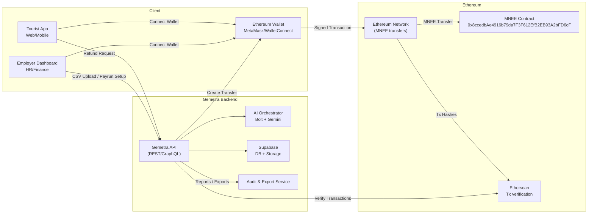

# 🌍 Gemetra-MNEE

**Global Remittance Infrastructure for VAT Refunds & Payroll**  
Wallet-native. AI-powered. Borderless. Built on Ethereum with MNEE stablecoin.

---

## 🚀 Overview

**Gemetra-MNEE** is an **on-chain VAT Refund & Payroll Payment Infrastructure** built for the **MNEE Hackathon: Programmable Money for Agents, Commerce, and Automated Finance**.

Using **MNEE**, a USD-backed stablecoin on Ethereum (Contract: `0x8ccedbAe4916b79da7F3F612EfB2EB93A2bFD6cF`), this platform enables:

1. **VAT Refunds** – Tourists submit refund requests → receive instant MNEE stablecoin payments on Ethereum.
2. **Payroll Automation** – Employers upload CSV → AI computes salaries → employees receive MNEE payments instantly.
3. **Scheduled Payments** – Automate recurring and one-time payments with calendar view and pre-approval system.

---

## 🛑 Problem

- **Tourist VAT Refunds** are slow, manual, and often unclaimed due to airport delays.
- **Global Payroll** is plagued by high fees, delayed wires, hidden FX costs, and compliance overhead.
- Both processes rely on **centralized, fragmented rails** that fail in a borderless world.

---

## ✅ Solution

**Gemetra-MNEE** provides a **wallet-native remittance infrastructure** where:
- Tourists **receive VAT refunds** instantly in MNEE stablecoin on Ethereum.
- Employers **disburse payroll globally** with a single transaction.
- **Automated scheduled payments** for recurring payroll and one-time future payments.
- Ethereum blockchain ensures **transparency** and **programmable money** capabilities.

---

## ⚙️ How It Works

### VAT Refund Flow
1. Tourist uploads invoice + VAT claim details or enters manually.
2. System validates eligibility and calculates refund amount.
3. Tourist connects Ethereum wallet (MetaMask, WalletConnect, etc.).
4. Refund delivered instantly in **MNEE stablecoin** on Ethereum.
5. Transaction recorded on-chain for transparency and audit.

### Payroll Flow
1. Employer uploads payroll CSV with employee details and salaries.
2. AI parses salaries, taxes, and generates payment plan.
3. Dashboard displays preview → CFO/HR approves.
4. Treasury wallet sends **MNEE payments** to employees via Ethereum.
5. Employees receive stablecoin salaries instantly.

### Scheduled Payments Flow
1. Employer schedules one-time or recurring payments for employees.
2. Set payment date, amount, and recurrence frequency (if recurring).
3. Optionally set pre-approval spending limit for automatic processing.
4. System checks for due payments every minute.
5. Payments within pre-approval limit process automatically.
6. Payments exceeding limit require manual approval via MetaMask.
7. All payments recorded on-chain with transaction hashes.

---

## 🔮 Features

- **Wallet-Native UX**: Connect any Ethereum wallet → confirm → receive MNEE.
- **Tourism-Grade Simplicity**: Refunds in 3 steps → Upload → Review → Confirm.
- **Enterprise Payroll**: AI-driven salary parsing and bulk MNEE payouts.
- **Scheduled & Recurring Payments**: 
  - Schedule one-time or recurring payments (daily, weekly, bi-weekly, monthly)
  - Calendar view to visualize all scheduled payments
  - Pre-approval system for automatic processing without MetaMask popups
  - Auto-process payments within pre-approved spending limits
- **Transparency**: All transactions on Ethereum blockchain with public audit trail.
- **Compliance Ready**: Supabase logs + JSON/CSV exports for regulators and finance teams.
- **MNEE Integration**: Built specifically for MNEE stablecoin on Ethereum.

---

## ⚡ High-Level System Architecture



---

## 🛠️ Tech Stack

- **Blockchain**: Ethereum (Mainnet/Sepolia)
  - MNEE Stablecoin Contract: `0x8ccedbAe4916b79da7F3F612EfB2EB93A2bFD6cF`
  - ERC20 token standard for programmable money.

- **Wallet Integration**: Wagmi
  - Supports MetaMask, WalletConnect, Coinbase Wallet, Nightly, and more.
  - Mobile-first signing with QR scan/deep link support.
  - Custom wallet selection modal with filtering and ordering.

- **AI Layer**: [Bolt.new](https://bolt.new) + Gemini
  - Salary parsing, jurisdictional tax/FX reasoning, transfer instruction generation.

- **Backend**: [Supabase](https://supabase.com/)
  - Postgres DB, object storage, user audit logs, and compliance artifacts.

- **Frontend**: React + Vite
  - Modern UI with Tailwind CSS and Framer Motion.

- **Transaction Verification**: Etherscan API
  - Real-time transaction tracking and verification.

---

## 📡 Data Flow

1. **Input**
   - VAT Refunds: Retailer receipts, passport/KYC snapshots.
   - Payroll: Employer CSV with gross pay data.

2. **Processing**
   - AI parses salaries, deductions, taxes.
   - AI validates VAT eligibility & calculates refunds.

3. **Persistence**
   - Supabase stores invoices, payruns, logs, validation proofs.

4. **Execution**
   - API encodes MNEE transfer → wallet signs & submits to Ethereum.
   - MNEE contract executes ERC20 transfers.

5. **Finality**
   - Ethereum confirms transactions.
   - Etherscan verifies results.
   - Supabase logs for audit.

6. **Audit**
   - Export JSON/CSV/PDF reports for regulators & enterprise compliance.

---

## 🔐 Security & Compliance

- **Treasury Wallet**: Multisig or HSM-protected wallet for payroll disbursements.
- **Dual Approval**: CFO + HR authorization required for bulk payruns.
- **Oracle Verification**: Only validated refunds are processed.
- **KYC/AML Hooks**: Wallet screening APIs integrated during onboarding.
- **Immutable Audit Trail**: Supabase DB + Ethereum tx hashes provide verifiable record-keeping.
- **Circuit Breakers**: Abort payruns if totals exceed configured treasury limits.

---

## 💰 Business Model

- **Platform Fees**: 0.5% per payout (tourist refund / payroll).
- **Enterprise SaaS**: Subscription-based dashboards & compliance exports for HR/finance teams.
- **Partnership Revenue**: Integration fees with VAT Operators & HR SaaS providers.
- **Future Yield**: Earn yield on idle treasury balances + capture micro-spreads on FX conversions.

---

## 📈 Go-To-Market (GTM)

- **Phase 1 – Tourism**:
  Pilot deployment at major airports with VAT operator integration.

- **Phase 2 – Payroll**:
  Target **DAOs, Web3 startups, and SMEs** with MNEE-based payroll rails on Ethereum.

- **Phase 3 – Enterprise Expansion**:
  Partner with **multinationals** and expand VAT refunds to EU, UK, Singapore, and Saudi Arabia.

- **Phase 4 – DAO Governance**:
  Transition to community-driven governance of refund % rates, fee splits, and expansion markets.

---

## 🔮 Roadmap

- ✅ **MVP**: Wallet-native VAT refunds + CSV-based payroll automation with MNEE.
- ✅ **Scheduled Payments**: Calendar view, recurring payments, and pre-approval system.
- 🔄 **Next**: Multi-country VAT support + AI-driven tax compliance engine.
- 🔄 **Later**: Enterprise integrations, PDF-based compliance exports, multi-signature approvals.
- 🌐 **Future**: Gemetra-MNEE DAO + full protocol governance.

---

## 🌟 Why MNEE on Ethereum?

Gemetra-MNEE leverages the unique advantages of MNEE stablecoin on Ethereum:

- **Programmable Money**: ERC20 standard enables smart contract automation and integration.
- **USD-Backed Stability**: MNEE provides price stability for payroll and refunds.
- **Ethereum Ecosystem**: Access to DeFi, wallets, and infrastructure.
- **Transparency**: All transactions publicly verifiable on Ethereum blockchain.
- **Developer-Friendly**: Standard ERC20 interface simplifies integration.
- **Global Reach**: Ethereum's network effects enable borderless payments.

---

## 🏆 Hackathon Alignment

This project aligns with the **MNEE Hackathon** requirements:

✅ **Uses MNEE Stablecoin**: Contract address `0x8ccedbAe4916b79da7F3F612EfB2EB93A2bFD6cF`  
✅ **Commerce & Creator Tools Track**: VAT refunds and payroll checkout systems  
✅ **Financial Automation Track**: Programmable invoicing and automated payroll  
✅ **AI & Agent Payments**: AI-powered salary computation and payment automation  

---

## 📦 Installation

```bash
# Install dependencies
npm install

# Set up environment variables
cp .env.example .env
# Add your Supabase credentials and API keys

# Run development server
npm run dev

# Build for production
npm run build
```

---

## 🔧 Configuration

### Environment Variables

Create a `.env` file in the root directory with the following variables:

#### Required Variables

```env
# Supabase (Required for data persistence)
VITE_SUPABASE_URL=your_supabase_url
VITE_SUPABASE_ANON_KEY=your_supabase_anon_key

# WalletConnect (Required for wallet connections)
VITE_WALLETCONNECT_PROJECT_ID=your_walletconnect_project_id
```

#### Optional Variables

```env
# Gemini AI (Optional - for AI assistant features)
VITE_GEMINI_API_KEY=your_gemini_api_key

# EmailJS (Optional - for email notifications)
VITE_EMAILJS_PUBLIC_KEY=your_emailjs_public_key
VITE_EMAILJS_SERVICE_ID=your_emailjs_service_id
VITE_EMAILJS_TEMPLATE_ID=your_emailjs_template_id
```

**Quick Setup:**
1. Copy `.env.example` to `.env` (if available)
2. Fill in the required variables (Supabase and WalletConnect)
3. Add optional variables if you want AI or email features
4. Restart the dev server: `npm run dev`

**See `ENVIRONMENT_SETUP.md` for detailed setup instructions.**

### MNEE Contract

The application uses the MNEE contract at:
- **Address**: `0x8ccedbAe4916b79da7F3F612EfB2EB93A2bFD6cF`
- **Network**: Ethereum Mainnet **ONLY** (no testnet available)
- **Standard**: ERC20

⚠️ **Important**: MNEE only exists on Ethereum Mainnet. There is no testnet contract.

**For Testing:**
- **Option 1**: Get real MNEE tokens from Uniswap, Rockwallet, or other exchanges
- **Option 2**: Deploy a mock ERC20 token on Sepolia for development (see `MNEE_SETUP.md`)

See `MNEE_SETUP.md` for detailed instructions on getting MNEE tokens.


